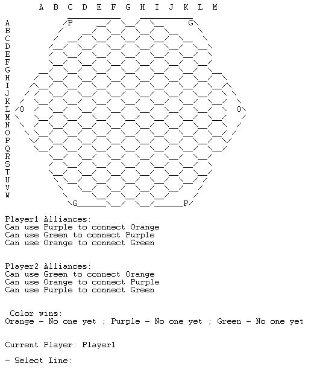
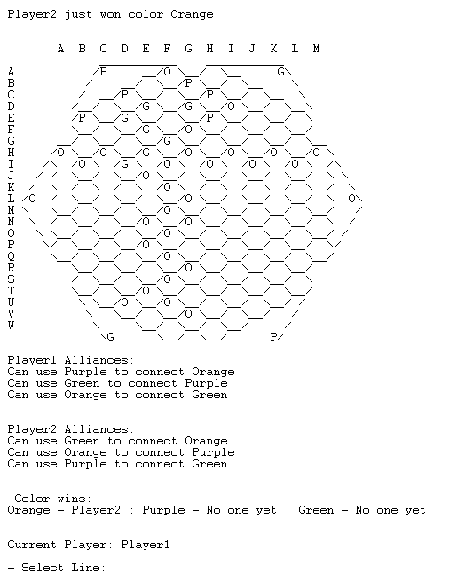
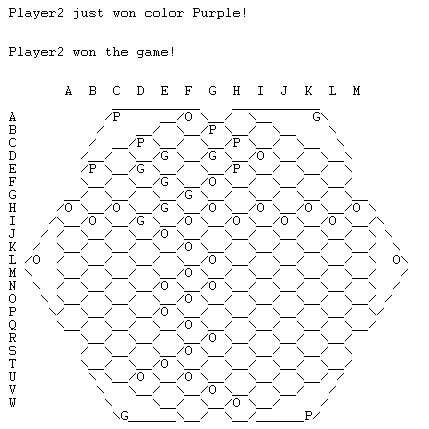
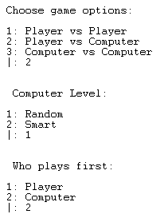
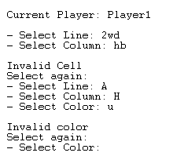

# PLOG 2020/2021 - TP1


## Informação do Grupo
- **Turma:** 3	
- **Grupo:** Alliances4
- **Jogo:** Alliances
- **Membros:** 
	- João Fernandes, up201806724
	- Clara Gadelho, up201806309 


----

## Instalação e execução

- Para jogar este jogo o utilizador tem que ter SICStus Prolog 4.6 instalado no seu computador.
- Em Windows é necessário abrir a consola do SICStus e fazer File -> Consult, escolhendo o ficheiro game.pl a partir da pasta do código-fonte.
- Em Linux é necessário abir o terminal e iniciar a consola do SICStus escrevendo sicstus-4.6.0 para depois escrever consult([path para o source code folder]/game.pl).
- Depois basta escrever play. e o jogo terá início.

-----

## Representação interna do estado do jogo:

#### Tabuleiro

O tabuleiro é representado por uma lista de listas, em que cada sublista é uma linha.
<br> Cada elemento da sublista representa uma célula do tabuleiro.

| Símbolo da lista:   | Representa:             |
| ----------------    | ---------               |
| 0                   | Célula Vazia            | 
| 1                   | Célula com peça Laranja |
| 2                   | Célula com peça Roxa    |
| 3                   | Célula com peça Verde   |


Implementação:

```
Board=[
          [0,0],
         [0,0,0],
        [0,0,0,0],
       [0,0,0,0,0],
      [0,0,0,0,0,0],
       [0,0,0,0,0],
      [0,0,0,0,0,0],
     [0,1,1,0,0,0,0], 
      [0,0,0,0,0,0],
     [0,0,0,0,0,0,0], 
      [0,0,0,0,0,0],
     [0,0,0,0,0,0,0], 
      [0,0,0,0,0,0],        
     [0,0,0,0,0,0,0], 
      [0,0,0,0,0,0],        
     [0,0,0,0,0,0,0], 
      [0,0,0,0,0,0],
       [0,0,0,0,0],
      [0,0,0,0,0,0],
       [0,0,0,0,0],
        [0,0,0,0],
         [0,0,0],
          [0,0]

    ]
 ```


#### Cores ganhas
A informação sobre o estado de vitória das cores é armazenado numa lista de três elementos. <br>
O primeiro elemento da lista representa o estado da cor laranja, o segundo da cor roxa e o terceiro da cor verde.
<br>
| Símbolo da lista:   | Representa:              |
| ----------------    | ---------                |
| -1                   | Cor ainda não ganha      | 
| 0                   | Cor ganha pelo Jogador 1 |
| 1                   | Cor ganha pelo Jogador 2 |

```
 Wins=[0,0,0]
```

#### Jogadores
Os jogadores são representados por uma lista de 2 elementos do tipo string.
<br>

```
 Players=['Player1','Player2']
```


#### Alianças de Cor
Para cada cor cada jogador tem outra cor que pode usar fazer conexões, sendo esta informação guardada numa lista com duas listas, cada uma com as cores aliadas de cada cor para o jogador correspondente: a primeira lista tem as conexões do primeiro jogador e a segunda do segundo jogador.
<br>

```
 Alliances=[['P ','G ','O '],['G ','O ','P ']]
```
#### Estado de Jogo
É representado por uma lista que contém o tabuleiro, as peças, as alianças, a lista de cores ganhas, a lista de jogadores e o modo de jogo.

```
GameState=[Board,Pecas,Alliances,Wins,Players,Mode].
```

-----

## Visualização do estado de jogo:

**Tabuleiro**<br>
A visualização do tabuleiro de jogo é realizada através do predicado printBoard(Board), que desenha recursivamente linha a linha todo o tabuleiro, através do predicado printLine(Line,Padding). Para o tabuleiro ficar com a forma hexagonal pretendida, é feito o cálculo do Padding necessário para cada linha e impresso através da função printPadding(Padding).
<br>
Para mais fácil visualização os valores da lista são representados assim:

| Símbolo da lista:   | Símbolo visualizado no ecrã:            |
| ----------------    | ---------               |
| 0                   |            | 
| 1                   | O                     |
| 2                   | P                    |
| 3                   | G                     |

**Informação Extra**
<br>
Para além de ser impresso o tabuleiro a nosaa função display_game(+GameState, +Player) imprime também as alianças de cada jogador, o estado de vitória das cores e o Jogador que está a jogar no momento.

#### Estado Inicial

#### Estado Intermédio

#### Estado Final



### Menus

Ao abrir o jogo, o utilizador encontra um menu para escolher as várias opções de jogo:
- Player vs Player;
- Player vs Bot (se esta opção for escolhida dá também para escolher quem joga primeiro e qual o nível do Bot);
- Bot vs Bot (quando esta opção é escolhida dá para escolher o nível de ambos os bots).



## Validação de Input

**Escolha de Jogada** <br>
Para a escolha de jogada, o utilizador tem que introduzir a Linha, a Coluna e a cor que pretende jogar. Todos estes inputs são de apenas 1 caracter, por isso é utilizado get_char() seguido de skip_line para se o primeiro caracter for válido os outros serem ignorados. <br> Caso o utilizador introduza inputs inválidos ou combinações inválidas de células ou queira colocar uma peça numa célula já ocupada, é avisado que a sua jogada é inválida e é pedido novamente que introduza o input necessário.




---
## Lógica do Jogo

### Lista de Jogadas Válidas

A verificação das jogadas válidas é feita pelo predicado 
valid_moves(+GameStates,+Player,-ListOfMoves) que coloca na lista de jogadas válidas todas as células do Board que ainda estão vazias, já que em todas elas se pode jogar uma peça.


### Execução de Jogadas

O predicado chamado para fazer a jogada do jogador é o humanPlays(+GameState,+Player,-AfterPlayGameState,-NextPlayer), que começa por imprimir na consola toda a informação do jogo com recurso ao display_game/2, depois entra no moveLoop(+GameState,-NewGameState), onde com o chooseCell(Line,Column,Color) pede ao utilizador que introduza a jogada que quer fazer e com o move(+Gamestate,+Move,-NewGameState) verifica se essa jogada é válida (se a célula onde o jogador quer jogar está vazia) e efetua essa jogada colocando a nova peça no board e atualizando o GameState com essa alteração. Depois, troca para o próximo jogador e verifica se o jogo terminou com o game_over/2. 


### **Final do Jogo**

Para fazer a verificação do fim do jogo usamos o predicado game_over(+Board,-Winner).
Para fazer essa verificação o predicado vê nas Wins se existe algum jogador que já ganhou 2 cores, sendo que para isso utiliza o predicado auxiliar ocurrenceof(+List,+Element,-Ocurrences) que conta o numero de vezes que um dado eleemnto aparece numa lista. Neste caso o elemento que estamos à procura é o índice dos jogadores, quando encontra o indíce de um jogador mais que uma vez na lista, então esse jogador ganhou.
O predicado chama printWinner(Winner) para escrever na consola quem ganhou e reinicia o jogo com play.


### Avaliação do Tabuleiro

A avaliação do estado do tabuleiro é feita com o predicado value(+GameState, +Player, -Value). Este predicado avalia o estado do jogo verificando se a ultima jogada efetuada fez com que algum jogador ganhasse ou bloqueasse uma das cores, retornando em Value o valor atualizado da lista de wins tendo em conta essa avaliação.
Para fazer esta avaliação recorremos a 5 predicados value/4, que são chamados à medida que o anterior falha. <br><br>
O primeiro value/4 a ser chamado verifica se o jogador atual ganhou alguma cor, ou seja, se existe algum caminho que ligue os lados da mesma cor do tabuleiro feito de células com peças dessa cor e da cor aliada do jogador. Isto é feito recorrendo ao predicado checkNormalWin(+Player, +Board, +Wins, +PlayerAlliances,-Color), que verifica para cada cor a existência do caminho com os predicados checkPurpleWin/3, checkGreenWin/3, checkOrangeWin/3. Estes predicados que têm a mesma função mas para cores diferentes chamam os predicados getPaths(+StartCells,+EndCells,-PossiblePaths), que coloca em PossiblePaths as combinações entre células de início e fim do caminho, e findAny(PossiblePaths,Alliances,Board), que sucede mal verifique que um desses PossiblePaths realmente existe. Assim é feita a verificação da vitória de cores. Caso não seja encontrado nenhum caminho para nenhuma cor, este predicado value/4 irá falhar, passando a execução para o seguinte.
<br><br>
O seguinte Predicado value faz exatamente o mesmo mas para o jogador contrário, já que a peça colocada pode também gerar uma vitória desse jogador.<br><br>
Caso esse também não suceda, é então verificada se foi bloqueada alguma cor por parte do jogador atual, com a chamado do predicado checkBlockWin(+Player,+Board,+Wins,+PlayerAlliances,-Color) que funciona da mesma maneira que o predicado checkNormalWin mas com a particularidade que calcula se já não existe caminho possível entre ambos os lados usando não só a cor e a cor aliada como também as células vazias, significando que um caminho já não pode ser feito. <br><br>
Depois se este também não ocorrer faz a mesma verificação para o outro jogador.
Se algum destes suceder, a lista de Wins é atualizada de acordo com o verificado e colocada em Value, senão Value fica como a lista de Wins já existente.

### Jogada do Computador

As jogadas do computador são feitas pelo predicado choose_move(+GameState, +Player, +Level, -Move).

Para o Level =0 (nível mais fácil) as jogadas escolhidas são aleatórias sendo selecionadas uma célula válida qualquer e uma cor e é colocada uma peça dessa cor nessa célula.

Para o Level =1 (nível mais difícil) o computador escolhe uma célula já ocupada e verifica se alguma célula adjacente a ela está livre e coloca nessa célula a mesma cor da célula selecionada anteriormente.

----
## Conclusões

Finalizando o projeto e analisando o trabalho desenvolvido, podemos dizer que conseguimos atingir os principais requisitos propostos.
No entanto, tivemos algumas dificuldades na implementação das condições de vitória.
Como este é um jogo de caminhos, para verificar o estado de jogo temos que verificar se para qualquer uma das três cores existe algum caminho que ligue os lados opostos do tabuleiro ou se a possibilidade dessa conexão já não existe. Isto são muitas verificações que tem um elevado custo de computação, o que leva a que, por vezes, o programa demore algum tempo a fazer essa verificação. De qualquer forma conseguimos implementar as condições de vitória e o seu funcionamento é o esperado, apesar da pontual demora na execução.
Este mesmo porblema levou a que também não conseguissemos fazer com que as jogadas do computador pudessem ser mais otimizadas, já que isto ia requerer que fossem verificados todos os caminhos possíveis e escolha do melhor. 
Por outro lado, os pontos que consideramos estarem melhor implementados são a interface do jogo, recolha de input do utilizador e validação das suas jogadas.
Por fim, concluímos que apesar das dificuldades encontradas ao longo da realização do projeto conseguimos aprender bastante sobre o funcionamento da linguagem e chegar a um resultado positivo.
